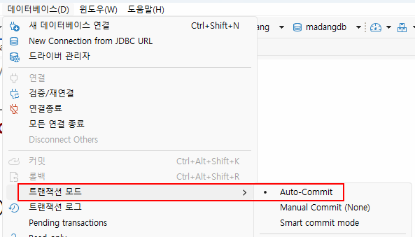

<<<<<<< HEAD
# iot-database-2026
2026년 iot개발자 데이터 베이스 리포지 토리

## 1일차

### 데이터/정보/지식

-`데이터` : 단순한 수치가 값
-`정보` : 데이터의 의미를 부여한 것
- 지식 : 정보를 통한 사물이나 현상에 대한 이해

### 데이터 베이스
- 조직에 필요한 정보를 위해서 논리적으로 연관덴 데이터를 구조적으로 통합, 저장해 놓은 것
-`도메인`- 자기 어무에 관련된 지식
- 기업/기관은 자기 도메인 정보만 저장
- 보통 cs 프로그램이라고 명칭. DB쪽이 서버, 프로그램
#### 데이터베이스 개념, 특징

-통합 데이터 - `데이터 중복 최소화` , 중복으로 인한 데이터 `불일치 현상 제거`
-저장 데이터 - 문서가 아닌 컴퓨터 저장장치에 저장. 반영구적 저장
-운영 데이터 - 저장된 상태에서 업무를 위해 사용. 검색 수정 등
-공용 데이터 - 여러 사람이 업무를 위해서 `공용으로 사용`

#### 특징
 
- 실시간 접근성 -  수 초내 결과가 리턴
- 계속적 변화 - 추가,수정,조회,삭제가 가능
- 동시 공유 - 여러 사용자가 동시에 공유. 같은 데이터를 사용하더라도 최대한 문제가 없게 처리
- 내용에 따른 참조 - 물리적인 저장 데이터가 아닌 데이터 값을 참조

#### DBMS

- 데이터베이스를 관리하는 시스템 DataBase Management System 의 약자
- DBMS를 데이터베이스, DB로 통칭,

#### dbms 장점

- 데이터 중복최소화, 데이터 일관성, 데이터 독립성, 관리기능(백업,복구,`동시성 제어`,), 개발 생산성,
데이터 무결성 유지 , 데이터 표준 준수 `데이터 무결성 중요`

###데이터 베이스 설치

#### 로컬 설치

1.https://www.mysql.com/ 사이트
2.MYSQL Community Edition 아래 링크 클릭
3.MySQL Installer for Windows 링크 클릭
4.MYSQL Installer 8.0.45 windows설치
5.회원가입이나 로그인 없이 No thanks, just start my download 클릭
6.mysql-installer-commuity-8.0.45.0msi 실행

#### 도커사용 설치

-Docker - dovmfflzpdltus tlsthr rncnr , xptmxm, tjqltmgkf tn dlTsms zjsxpdlsj rlqksdml rktkdghk vmffotvha

- dhsfkdls tkddptj dlalwlfmf ekdnsfhdem
-tlfgodgksms zjszxpdlsjfh aksema

1.도커설치
-https://www.docker.com/ dowmload docker window 클릭
    
    -close and restart로 재부팅
    -DOcker dscription Service Agreement 창 Accept 클릭
    -Linux 용 Windows 하위 시스템 설치 필수 `wsl --update` 실행
    
2.도커 설정
- 설정 들어가서 start docker singn in 체크
3.도커 콘솔 명령어
    ``` powershell
    >docker
    >docker --version
    >docker search 이미지명
    >docker pull 이미지명
    >docker run ...
    ```
3.MySQL 설치

4.MySQL 설치
    -Powershell 열기
    -docker search 는 도커허브를 검색 기능

    ```powershell
    >docker searchmy sql
    ```


    --docker pull 이미지 다운

    ``` powershell
    >docker pull mysql:8.0.45
    ```powershell

    # \는 윈도우에서 사용불가, 여러줄 명령 불가능


    

    docker run -d --name mysql80 -p 3306:3306 -e MYSQL_ROOT_PASSWORD=my123456 -e MYSQL_DATABASE=mydb -e MYSQL_USER=myuser -e MYSQL_PASSWORD=my123456   -v  mysql80_data:/var/lib/mysql --restart unless-stopped mysql:8.0.45

     -필요 계정
        -root(관리자) - my123456
        -myuser(일반사용자) -my123456


     - 옵션 설명
     - `--name mysql180` :컨테이너 이름
     - `-p 3306: 3306` : 포트번호 컴퓨터에서 접근하는 포트 : 컨테이너 내부에서 사용하는 포트 번호
     - `MYSQL_ROOT_PASSWORD` : MYSQL 관리자 root 계정 비밀번호 초기화
     - `MYSQL_DATABASE`:컨테이너 시작시 자동 생성할 DB
     - `MYSQL_USER/MYSQL_PASSWORD` : 일반 사용자 계정
     - -v mysql80_data:/var/lib/mysql 컨테이너 내 mysql 데이터 저장위치
     - --resatart unless - stopped : 도커 재시작시 자동 복구

     -docker ps -현재 실행중인 컨테이너 확인

     -docker exec - 

5.MYSQL Workbench 설치

    - Database 개발툴
    - 로컬에서 다운로드한 MySQL Installer 8.0.45 설치 
    -MySQL Connections 옆 동그라미 +

    

    

6.DBeaver 개발툴 설치 

7.Visual Studio 확장 설치

- 확장 >Database rjator
-Database Client 설치
-연결은 다른 개발툴과 동일


도커 사용 및 설치


### 기본이론
#### 관계형데이터 베이스

-Relational Database
    -1969년 E.F수학 모델에 근간하여
    -테이블을 최소단위로 구성
    - 각 테이블간 관계를 통해서 데이터모델 근간
#### MySQL 접속

- 관리자계정 - root
    -새 사용자 생성, 새 데이터베이스 생성, 권한 , 백업 및 복구
- 일반계정 -mysq;
    -해당 데이터베이스에서 데이터 처리 작업
#### SQL

-structured query languase
-구조화된 질의 언어
-데이터베이스에서 데이터 조작, 테이블 객체를 컨트롤하는 프로그래밍 언어

-DML -대이터 조작언어 SELECT,INSERT,UPDATE,DELETE DHK RKXDMS EPDLX같은 데이터 조작 어
-SQL 종류
-Data Dfinition Language 데이터 정의어를 처리하는 언어
-data control language grant revoke와 같이 사용자에게 권한 주고 해제하는 기능을 처리하는 언어
-Transaction Control Language -트랜잭션 제어어 .BEGIN TRAN, COMMIT, ROLLBACK 같은 트랜잭션 동시성 제어를 위한 언어

### SELECT 실습

- DBeaver 설정
    -환경 설정>>편집기>SQL편집기>SQL포맷
    -KEYWORD UPPER로 변경

    -- 조건 필터링 (필요한 행, 레코드)만 조회할 때
    SELECT *|열이름 나열
    FROM 테이블명
    WHERE 조건...;

    --정렬하고 싶을 때
    --ASCending (오름차순)|DESCending(내림차순)
    SELECT *|열이름 나열
    FROM 테이블명
    WHERE 조건...
    ORDER BY 열1,열2 ASC|DESC;
    ```

## 2일차

### 도커 사용하는 이유
- 도커가 뭐냐? sql이나 db 환경설정을 줄여주는 도구
- 설치 편의성 - 이미지만 있으면 컨테이너로 실행하는데 수십초밖에 안걸림. 설치가 불필요한 장점이 있음
- 환경격차 문제 해결 - OS단의 설정까지 건드려야하는 문제를 없애고, 간단하게 서비스를 실행 가능
- 서버비용 절감 - 새로운 서비스를 할 때마다 하드웨어 서버를 구매, 설정할 필요 없음
- OS에 독립적 - 이미지 받아서 실행만 하면됨
- 가상머신보다 빠름 - VMWare, Virtual Box 와 같은 가상 os 머신보다 실행속도가 빠름. 필요없는 기능과 용량 제거

### AI시대 PostgreSQL 학습

- DB 시장에서 Oralce, MYSQL, SQLServer 다음 PostgreSQL이 4위
- AI 시대에 더 비중이 오름
- 나중에 학습할 것

### DBEAVER 접속설정 다시


### select 실습

- 기본문법

    ```sql
    SELECT ALL|DISTINCT 컬럼1, ...
      FROM 테이블명 
      WHERE 필터링조건
      GROUP BY 그루핑 컬럼 1, 컬럼2...
      HAVING 집계함수필터링조건//그룹바이 후 집계함
      ORDER BY  정렬 컬럼1,컬럼2 DESC;
    ```

-WHERE 절 - 전체 데이터에서 필요한 절만 필터링

    -비교 : =, <>(같지 않다),!=(Db 종류별로),<,>,>=,<=
    -범위 : BETWEEN a AND b, 초과, `미만은 사용불가` `날짜는 조심`할 것!
            - price BETWEEN 10000 AND 20000
    -집합 : IN, NOT IN
        -price IN (10000,20000,25000) -- 가격이 1만, 2만, 2만 5000에 속하는 데이터
        -price NOT IN (10000,20000) -- 가격 1만 2만 제외한 데이터
    -패턴 : LIKE (문자열만),%,_
        -bookname LIKE '축구%'  -- 책 제목중 축구로 시작하는 책 모두
    -NULL : 데이터가 없는 것, 입력되지 않은 것, =로 비교하지 X!
    -price IS NULL, price IS NOT NULL
    -복합 : AND(&&와 동일), OR (C++ ||), NOT (C++ !)로 비교 조합
        -(price<20000) AND (bookname LIKE '축구의 %')

    문법 정리
    SELECT 컬럼   //조회할 열 선택
    FROM 테이블 //어느 테이블에서 가져올지
    WHERE 조건; //조건

    SELECT bookname
    FROM Book
    WHERE price > 20000;// 가격이 20000보다 큰 책 이름 조회

-ORDER BY - 정렬 ASC(오름차순), DESC(내림차순)

-Alias - 별명으로 컬럼명, 테이블명등 원래의 이름을 바꿔쓰고 싶을때 AS 사용
    -"쌍따옴표로 별명을 지정하는 것을 추천.(스페이스사용 등)

-GROUP BY, 집계 함수 - DB를 사용하는 가장큰 목적 중 하나
    -SUM() :총합,숫자컬럼만
    -COUNT() :총 개수,컬럼 대신 *가능
    -MIN() :최소값, 숫자컬럼만
    -MAX() :최대값, 숫자컬럼만
    -AVG() :평균값, 숫자컬럼만
    -STD() :표준편차 나중에

- HAVING - 일반 필터링은 WHERE 절로, 집계함수 필터링은 HAVING절로

-GROUB BY, HAVING 주의사항
    -GROUP BY에 포함되지 않은 컬럼은 SELECT에 사용할 수 없음!
    -집계함수 외 일반컬럼은 SELECT와 GROUB BY를 일치 시킬 것
    -HAVING 절에는 집걔함수 필터링 포함
    -WHERE절에 집걔함수 사용 불가 ~
    -외울때는 SELECT, FROM,WHERE,GROUP BY, HAVING , ORDER BY 순 기억

-JOIN - 관계형 DB의 핵심 기능
    -두개 이상의 테이블을 합쳐서 하나의 테이블처럼 보여주는 기법

-JOIN 종류 - 종류는 많으나 3ㅏ지만 알면 됨
    -INNER JOIN(내부조인) - 조인중에서 가장 간단한 조인 ./ 컬럼이 일치하는 데이터만조회
    -OUTER JOIN(외부조인) - 한테이블 기주으로 데이터가 일치하지 않는 데이터 까지 나오도록 조회하는 조인

    -LEFT OUTER JOIN - 두개의 테이블 중 앞쪽 테이블 기준
    -RIGHT OUTER JOIN - 두개의 테이블중 뒤쪽 테이블 기준

#### 서브쿼리(부속질의)

- SubQuery - 쿼리 내부에 포함되는 하위쿼리. 항상 소괄호 () 내에 작성
- 서브쿼리는 소괄호 안의 쿼리 부터 작성
- 메인쿼리 - 소괄호 밖의 쿼리
- 서브쿼리 - 소괄호 안의 쿼리
- 대부분이 조인으로 변경 가능
- 조인이 가지고 있는 성능개선의 특징을 사용못하기 때문에 속도저하가 발생할 가능성 높은
- 조인은 많이 사용한다면, 서브쿼리는 필요할때만 사용

## 3일차

### SELECT 실습
DB 기본타입 - 문자열, 숫자, 날짜시간
#### 서브쿼리 계속

-WHERE 절 서브쿼리
-FROM 절 서브쿼리
-SELECT 절 서브쿼리


- 서브쿼리 종류


#### 집합연산

- 두 테이블 합치기 [쿼리](./day03/script-4.sql)

#### GROUP BY 추가 기능

- GROUP BY  컬럼 WITH ROLLUP - 전체 합산 추출
- ROLLUP을 안쓰면 쿼리가 아주 길어짐

### DML 기타
-DML 주에서 직접적인 트랜잭션 영향을 받지 않는 것은 SELECT 뿐
#### INSERT

- 테이블에 데이터를 삽입하는 쿼리
- 트랜잭션 영향을 받음

    ```sql
    INSERT INTO 테이블명(컬럼1, ...컬럼n)
    VALUES(컬럼 1값 ..., 컬럼n값)
    ```

-UPDATE나 DELETE와 달리 큰 문제가 발생하지 앟음
-잘못 입력되면 지우면 됨

#### UPDATE

- 테이블에 존재하는 데이터를 수정하는 쿼리
- 트랜잭션의 영향을 받음

#### DELETE

-테이블에 존재하는 데이터를 삭제하는 쿼리
-트렌잭션에 영향을 받음

#### 트랜잭션 처리

-UPDATE,DELETE,(INSERT포함) 처리오류가 발생하면 복구할 수 있는 기능 존재
-8장에서 다룰 예정


### DDL

- 객체 생성하고 , 삭제하는 기능을 하는 SQL언어
#### MySQL 데이터타입
-BOOL -true/false
-TINYINT,SMALLINT -1바이트 숫자임(255개),2바이트
-INT-4바이트
-BIGINT-8바이트
-DECIMAL(m,n)-m은 전체 자리수 65자리 n 소수점 최대 자릿수 30
    -정수가 35자리, 소수점 30자리인 아주 큰수
-FLOAT
-DOUBLE
-DECIMAL(m,n)
-DATE - 날짜만 2025-03-17
-DATETIME-날짜와 시간 모두 2026-03-17
-CHAR(n)-고정길이 문자열 n만큼 길이 지정
    -CHAR(10)'HELLO     '로 저장
    -나머지 스페이스로 채움
    -주민번호, 공통코드처럼 길이를 정확히 입력
-VARCHAR(n) - 가변길이 문자열 n만큼 길이 지정
    -VARCHAR(10)은 'Hello'로 저장 . 나머지 5자리는 없앰
    -길이를 넘어서는 문자열을 입력되지 않음(잘림)
    -char,varchar는 길이를 여유있게 설정
-TEXT,LONGTEXT - 아주 긴 문자열, 2~4GB
-BLOB- 바이너리로 저장되는 큰 데이터, 2~4GB

#### CREATE

- DB객체를 생성하는 쿼리[쿼리](./day03/script-5.sql)
- 데이터베이스,테이블,뷰 인덱스 등 주요 객체를 생성가능

```SQL
CREATE TABLE 테이블명(
    컬럼1이름 데이터타입 제약조건,
    컬럼2이름 데이터타입 제약조건,

    ...
    컬럼n이름 데이터타입 제약조건
    [각 제약조건 독립적으로 작성]
);
- 데이터베이스 생성
CREATE DATABASE 데이터베이스명;
- 사용자 생성
CREATE USER 사용자명 IDENTIFIED BY 비번;

```

## 4일차

### MySQL 샘플DB

-샘플DB

- Sakila-db-MySQL 버전충돌로 현재 사용불가

- INSERT INTO 대량 삽입

### DML 추가

- INSERT INTO 대량 삽입 - My SQL 방법

```sql
INSERT INTO 테이블명 VALUES (컬럼1값, 컬럼2값, ... 컬럼 n 값),
(컬럼1값, 컬럼2값, ... 컬럼 n 값),
(컬럼1값, 컬럼2값, ... 컬럼 n 값),
...
(컬럼1값, 컬럼2값, ... 컬럼 n 값),
여러번복사됨

### DDL 계속

#### 제약조건 개요

-데이터베이스에 정확한 데이터가 들어갈 수 있도록, 테이블 각 컬럼별 입력가능한 데이터를 지정하는 것
-무결성을 벗어나는 데이터는 못들어가도록 제약(제한)을 주는 것
-종류: `기본키(PRIMARY KEY)`,단일(UNIQUE),널허용여부


#### CREATE 계속

- CREATE 구문
    -PRIMARY KEY (컬럼1 또는 여러개)
    -FOREIGN KEY (custid) REFERENCES NewCustomer ON KELETE CASCAKE
        -REFERENCES:참조하는 부모테이블과 PK컬럼
        -ON KELETE CASCADE:무결성 유지를 위해서 부모테이블의 해당PK데이터를 삭제하면 자식 테이블도 삭제함
        -ON DELETE SET NULL : 부모 테이블에 PK값이 삭제되면, 자식테이블의 FK값은 NULL로 변경한다
        -ON UPDATE CASCADE | SET NULL : 수정할 때도 삭제시와 유사한 처리 가능. 수정도 가능하지만 PK 수정이 거의
        없기 때문에 많이 사용되지 않음
-AUTO_INCREMENT :테이블에 데이터 삽입할때 숫자타입 PK 값을 자동 증가시켜서 만들어주는 기능
-PK 칼럼은 INSERT문에서 생략


#### ALTER

- ALTER
    -객체 수정 테이블 외에서는 많이 사용안됨

    ```sql
    ALTER TABLE 테이블명
        [ADD 속성 데이터타입]
        [DROP COLUMN 컬럼명]
        [MODIFY 속성명 데이터타입 ]
        [MODIFY 속성명 [NULL|NOT NULL] ]
        [ADD PRIMARY KEY(칼럼명) ]
        [[ADD|DROP]제약조건명]
    ```
#### DROP

-DROP 
    -객체 삭제
        -테이블에서는 관계를 맺고있는 자식테이블 먼저 삭제 후 부모테이블 삭제 가능

        ```SQL
        DROP 객체 객체명
        ```

###내장 함수

- C,C++ 내장함수와 동일

### NULL

-- 이직 지정되지 않은 값.
- '0','',' ' 과 다름
- C,C++,'\O 과 동일한 의미
- 비교연산 불가 (=,>,<,<=) 대신 IS IS NOT만 사용가능
NULL값을 연산하면 결과도 NULL이됨
-NULL+숫자=> NULL
-집계함수 계산 시 NULL 포함된 행은 집계에서 빠짐(!)

## 5일차
### 쿼리연습


### 뷰
서브쿼리를 반복적으로 작성하는 것을 피하기 위해서 사용함

- VIEW - [쿼리](./day%2005/view.sql)
편의성과 재 사용 일반테이블 사용하는 것처럼 사용하고 여러번 사용가능
-보완성 : 개인정보와 같은 민감한 데이터의 공개를 막을 수 있음
-독립성 : 일반 테이블처럼 사용, 사용자가 필요한 정보만 가공할 수 있음. 원본 테이블을 변경할 필요 없음

- 뷰 특정
 - 실제 데이터가 아님. 원본 데이터가 바뀌면 뷰 데이터도 같이 갱신 됨
 - 독립적인 인덱스 생성 어려움(속도가 빠르지 않을 수 있음)
 - 뷰이지만 데이터 INSERT,UPDATE 등이 가능
 - INSERT,UPDATE,DELETE는 거의 불가
 - 뷰는 보기 위해서 생성하므로 SELECT 이외 DML은 자제할 것
 - 서브쿼리를 복사하는 용도가 제일 큰거니
### 인덱스

- INDEX [쿼리](./day%2005/index.sql)
    ```sql
    CREATE INDEX 인덱스면 ON 테이블명 (컬럼명);
    ```

- INDEX
    -책 뒤편 찾아보기, 인덱스와 동일한 역할
    -테이블에 하나이상 설정가능(인덱스를 건다라고 부름)
    -인덱스가 없으면 `Full Table scan`, dlseprtmrk dlTdmaus `Index Range scan` dmfh qusrud
    -내부적으로 B-TREE 자료구조 사용, ``$0(logN)$

    ```sql
    CREATE[UNIQUE] INDEX 인덱스명 ON 테이블명 (칼럼명,...[ASK|DESC]);
    ```

    --인덱스 생성
    DROP INDEX 인덱스명;

    --인덱스 삭제
    DROP INDEX 테이블명;
    ```

    - 인덱스 종류
    -기본키 인덱스:Primary키에 자동으로 걸리는 인덱스
    -UNIQUE 인덱스: Unique 제약조건의 컬럼에 걸수 있는 인덱스, NULL은 허용하는데 데이터 중복은 불가
    -일반 인덱스: 중복허용. 인덱스 효과가 그렇게 좋지않음 미흡함
    -복합 인덱스: 두개이상의 컬럼을 하나의 인덱스로

- 인덱스 구분
    - 클러스터 인덱스: 테이블당 하나만 생성 . 데이터 자체가 정렬되는 것
    - 넌클러스터 인덱스: 여러개 가능 인덱스가 데이터 따로 생성. 클러스터 인덱스 생성 후 모든 인덱스가 전부 넌클러스터 인덱스

-`인덱스 주의사항`
    -인덱스를 생성한다고 무조건 속도가 빨라지는 것은 아님.
    -WHERE절에 자주 사용되는 컬럼에 인덱스를 걸어야 함.(PK에 자동으로 인덱스 생성)
    -JOIN에 사용되는 FK에도 인덱스를 걸면 속도 개선
    -단일 테이블에 인덱스를 너무 많이 걸면 반대로 속도가 느려짐(테이블당 4개정도 인덱스 권장)
    -인덱스마다 ASC,DESC로 정렬해야 되기때문에 부가적인 처리가 많아짐
    -자주 변경, 삭제되는 컬럼에 인덱스를 걸지 말것
    -중복이 많이 되거나,NULL이 많은 컬럼은 인덱스효과 미비
### 트랜잭션, 동시성제어


#### CTE [쿼리](./day%2005/CTE.sql)

- Common Table Expression: 공통으로 쓸 수 있는 테이블 표현기법
    -여러곳에서 공통으로 사용할 임시 테이블형태 쿼리
    -이름을 지정하는 임시 테이블
    -왜쓰냐 쿼리를 깔끔하게 생성하기위해
    -쿼리실행동안 재사용


    ```sql
    WITH cte이름 AS(
        SELECT...
    )
    SELECT *
      FROM cte이름;


## 6일차

### 트랜잭션, 동시성제어

    -Transaction Control Language 에 포함된 `START TRANSACTION`,`COMMIT`,`ROLLBACK`,`SAVEPOINT`학습

#### Transaction

-트랜잭션
    -일을 처리하는 논리적인 단위 그룹
    -여러 쿼리들이 실행되어 완성되는 하나의 논리 그룹처리 단위

-계좌이체 예시
    -A가 B에게 100만원 보낸다
    1. A의 계좌에서 100만원 차감
    2.B의 계좌에 100만원 추가
    3.1번만 실해되고 2번이 실패하면 돈 사라짐
    4.2번만실행되고 1번이 실패하면 돈이 복사

    -트랜잭션 4가지 특징 (ACID)
    -원자성 : 전부 성공 OR 전부 실패(ALL or Nothing),  중간상태 없음
    -일관성 : 거래 전후로 데이터 규칙이 유지됨,전체 합은 변경없음
    -격리성 : 여러사람이 동시에 처리해도 서로 영향이 없음
    -지속성: 성공한 처리는 절대 사라지지 않음

    #### DBEAER 툴 트랜잭션 선택
- DBEAVER 기본적으로 트랜잭션을 사용못하게 되어 있음 - Auto Commit 설정 중

    
    -Manual Commit 으로 변경후 테스트
-환경 설정>연결>연결 유형 아래 `AUTO-COMMIT BY DEFAULT` 체크해제->트랜잭션 사용모드

-단 Auto-Commit을 끄면 sql에디터 마다 커밋 , 롤백
#### 트랜잭션 쿼리

```sql
START TRANSACTION; -- 트랜잭션 로직에 진입
동시성 제어를 하면 lock이 걸린다


-- 여러가지 쿼리 실행

COMMIT; -- 성공했으면 모두 저장! 성공 저장이랑 동일
ROLLBACK; --실패했으면 모두 원상복구. 실패 복구
```

- 세이브 포인트
    ```sql
    -- 트랜잭션 중
    SAVEPOINT sp명;

    -- ... 오류가 발생시
    ROLLBACK TO sp aud;

    COMMIT;
    ```
#### 동시성 제어

-개요
    -여러 트랜잭션이나 프로세스가 동시에 실행될때 데이터의 일관성을 유지하면서 처리하는 것[쿼리](./day%2006/TRANSACTION.sql)
    -Lock,Isolation Level Wvcc

    -세이브 포인트 [쿼리](./day%2006/SAVEPOINT.sql)

-행단위락(row lock) -일반적인 rock
    -세션 1번이 특정 테이블의 데이터를 update나 delete시 트랜잭션을 종료하지 않으면
    -세션 2번이 같은 테이블의 데이터를 update나 delete로 할수 없음

    락걸린상태

    -50초 후 락상태 해제

    -서로 다른 행 데이터를 편집할 때는 락이 걸리지 않음
-격리수준- 동시 여러 트랜잭션이 실행될때 서로의 데이터에 얼마나 영향을 줄지 제어하는 기준
    -최하 - Read Uncomitted 커밋되지 않은 데이터 읽을 수 있음
    -중간 - Read Committed 커밋된 데이터만 읽음
    -기본 - Repeatable Read MySQL 기본값 같은 트랜잭션 안에서는 항상 같은 결과
    -최고 - sserializable 순차적실행 동시성 거의 없음. 안전하지만 성능 최악

-동시성 제어문제

-Dirty Read-
-Non-repeatable Read - 같은 트랜잭션 안에서 같은 데이터를 두번 읽었을때 결과가 다른 현상
-Phantom Read

격리수준과 동시성 제어 정리
-최하 커밋 되지않은 데이터
-중간 커밋된 데이터
-기본 트랜잭션 안에서 같은 결과
-최고 순차적실행 동시성 X

### 보안 및 관리

#### TKDYDWK

-사용자 생성 및 삭제
    -데이터베이스를 사용할 계정을 생성 쿼리

    ``
    --사용자 생성
    CREATE USER '사용자명'@'localhost|% IDENTIFIED BY'비밀번호';
    -- 사용자 생성 비밀번호 변경
     CREATE USER '사용자명'@'localhost|% IDENTIFIED BY'비밀번호';

    -- 사용자 삭제
    DROP USER `사용자명`
    ```
#### 사용자

-DDL일부

#### 권한
- 사용자에게 권한 부여 및 해제,DCL
    -대부분 관리자가 수행
    -GRANT,REVOKE

    ```sql
    -- 권한 부여
    GRANT ALL PRIVILEGES ON 데이터베이스 * TO `사용자명`@`localhost|%;

    -- 특정권한 부여
    
    --권한 해제
    REVOKE ALL PRIVILEGES ON 데이터베이스.*FROM;
    ```

- DCL

### MY SQL백업 복구
- dump, resore
    * sql 파일로 내보내기

    

### MySQL 프로그래밍


#### 데이터베이스 프로그래밍
- 각 DB마다 프로그래밍 언어 상이
###C/C++MySQL연동

### 사용자 정의 함수
-내장함수에 없는 기능에 함수를 추가로 개발하는 것
### 저장 프로시저

-저장 프로시저
    -함수와 달리 리턴값이 없음 , 단 out 파ㅡ라미터로 결과를 돌려받을 순 있음
    -일반 쿼리문에 포함불가
    -단독 실행 또는 배치에 따라 실행
    -사용자 없는 새벽에 대량 처리 수행할때

-생성
    -DBEAVER해당 폴더에서 마우스 오른쪽 버튼 >CREATE NEW PROCEDUR
    -NAME, 필요한 프로시저명 입력
    -TYPE, PROCEDURE 선택
    -작성 후 Save 클릭 

#### 커서
    - cursor - 저장 프로시저 쿼리 참조
    -마우스 커서와 동일하게 테이블의 한 위치를 가르키는 객체
    -테이블의 데이터를 한 행씩 처리하기 위해서 사용함
    -cursor,open,FETCH,Close

#### 트리거

-trigger
    -방아쇠를 뜻함. 하나의 테이블에서 insert update,delete 문이 실행되면 다른 테이블이나
    다른 처리가 자동으로 실행되는 저장 프로그램 중 하나
    -before Trigger 보다 after trigger가 많이 사용
    -시스템 로그 기능에 많이 사용됨 

    
#### 데이커 베이스 모델링
#### 모델링

-개요
    -현실세계에 존재하는 시스템을 컴퓨터 시스템으로 변환하기 위한 디자인
    -현실세계의 데이터를 DB상에 입력해서 프로그램에서 사용할 수 있도록 설계
    -현실세계 데이터와 DB상 데이터가 일치
    -예.오프라인 매장->온라인 매장, 시립 도서관->온라인 시립 도서관, 백화점->모바일 백화점

-데이터베이스 생성주기
    -요구사항 수집 및 분석>설계>구현>운영>감시 및 개선
-sw 생명주기
    -요구사항 수집 및 분석 > 설계>구현>테스트>배포>유지보수/관리

-DB 설계의 순서
    1.개념 모델링:요구사항에 따른 개념적인 모델링으로, 추상적인 도형으로 관계 구성
        - 각 테이블이 될 엔티티 추출
        - 테이블의 컬럼이 될 속성 추출
        - 속성 구분자가 될 키 추출
    2.논리 모델링:개념 모델링을 바탕으로 속성, 키, 관계 명확히 정의
            - 데이터 중복을 최소화하는 `정규화` 수행
            - 관계형 데이터모델 테이블화, 구체화
    3.물리 모델링
        -실제 DB 종류를 고려해서 설계
        -테이블, 컬럼, 인덱스, 제약조건 뷰 등 객체들 생성, 성능을 위해 `반 정규화` 진행
        -최종 스키마 완성
        -실제 데이터베이스화, 내보내기 기능

## 7일차 

#### ERD 작성

-정규화,반정규화,개념/논리/물리다이어그램
### c/c++MySQL 연동

-개발방번
    -MySQL 8.0이상
    -MySQL Connector/c++라이브러리 설치
    -Visual Studio 프로젝트 생성
    -c++코드 작성
#### My SQL Connector /c++라이브러리
-시스템 속성
    - 고급 >환경변수< path에 MySQL관련 ddl이 위치하는 경로 추가
    - vs나 콘솔 재시작
#### Visual Studio 프로젝트 속성

- 프로젝트 속성
    -C/C++>일반>추가 포함 디렉토리
    -c:\Program Files\MySQL Connector C++ 9.6\include 추가

### 데이터베이스 모델링


## 8일차

### 데이터베이스 모델링

#### ERD

-Entity Relationship Diagram


=======
SD
>>>>>>> e476bd29f57c4d7c24573b9005aa29ea87669cd0
